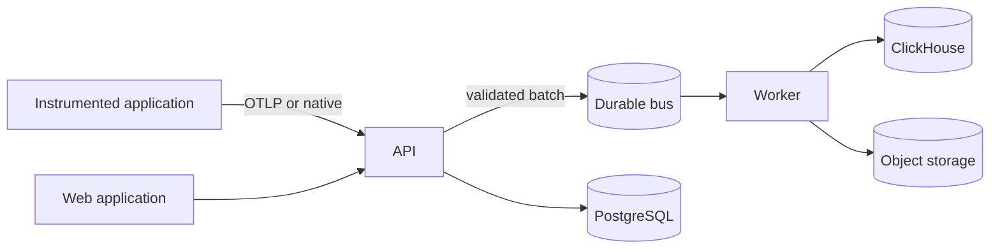

# AI Observability Platform

Tracing, retrieval inspection, agent trajectories and cost accounting for AI
applications.

An LLM request is not one operation. It is a prompt render, a retrieval, a
rerank, a generation, three tool calls and a retry — spread across services,
costing real money, and producing a different answer each time. Conventional
APM shows you a 4-second span called `POST /chat` and stops. This platform
shows you those 4 seconds broken down, which prompt version produced them,
which documents the model actually read, what it cost, and what changed since
the run that worked.

---

## What it does

| Capability                    | What you get                                                                                                                                                 |
| ----------------------------- | ------------------------------------------------------------------------------------------------------------------------------------------------------------ |
| **End-to-end tracing**        | Every request as a span tree, across services, with the critical path marked and retries grouped. OTLP-native.                                               |
| **Version lineage**           | Every trace links to the exact prompt, model configuration and dataset version that produced it. Versions are content-addressed and immutable; aliases move. |
| **Retrieval visualisation**   | The whole pipeline — query, rewrite, embed, retrieve, rerank, select — with per-document scores, rank movement, and which chunks actually reached the model. |
| **Agent trajectories**        | The run as the DAG it is: branches, retries, loops, handoffs and tool calls, with a deterministic layout.                                                    |
| **Cost and token accounting** | Exact decimal arithmetic against an effective-dated price book. Unpriced usage is reported as unpriced, never as free.                                       |

## Try it

```console
$ make setup        # virtualenv, dependencies, .env
$ make dev-local    # API and worker on the host, SQLite files, no Docker
```

In another terminal:

```console
$ make bootstrap                                  # first org, project and API key
$ make seed PROJECT=prj_...                       # demo traces
$ npm run dev --workspace @aiobs/web              # http://localhost:53000
```

Or run the whole stack — PostgreSQL, ClickHouse, Redis, Redpanda, MinIO — in
Docker:

```console
$ make dev
```

Then send your first trace: [docs/tutorials/first-trace.md](docs/tutorials/first-trace.md).

## Instrumenting an application

```python
from aiobs import Client

client = Client()  # reads AIOBS_ENDPOINT and AIOBS_API_KEY

with client.trace("answer-question", session_id=session) as trace:
    with trace.retrieval_span("search") as span:
        documents = retriever.search(question)
        span.record_retrieval(query=question, documents=documents)

    with trace.generation_span("answer") as span:
        span.record_model(provider="openai", model="gpt-4o")
        response = openai.chat.completions.create(...)
        span.record_usage_from(response)
```

The SDK never raises into your application. If the platform is unreachable,
spans are dropped and your request still succeeds — instrumentation that can
take down the thing it observes is worse than none.

Full guides: [Python SDK](docs/sdk/python.md) · [TypeScript SDK](docs/sdk/typescript.md) ·
[OTLP without an SDK](docs/sdk/otlp.md)

## How it fits together



The API validates and acknowledges; the worker does the expensive work.
Ingestion is idempotent end to end, so a retried batch produces no duplicates.
Read [docs/architecture/overview.md](docs/architecture/overview.md) for why each
boundary is where it is.

## Documentation

|                  |                                                                                                                                                                                                                                                                                                                                                                                                                 |
| ---------------- | --------------------------------------------------------------------------------------------------------------------------------------------------------------------------------------------------------------------------------------------------------------------------------------------------------------------------------------------------------------------------------------------------------------- |
| **Concepts**     | [Data model](docs/concepts/data-model.md) · [Semantic conventions](docs/concepts/semantic-conventions.md) · [Versioning and lineage](docs/concepts/versioning-and-lineage.md) · [Cost attribution](docs/concepts/cost-attribution.md) · [Retrieval](docs/concepts/retrieval.md) · [Agent trajectories](docs/concepts/agent-trajectories.md) · [Sampling and retention](docs/concepts/sampling-and-retention.md) |
| **Architecture** | [Overview](docs/architecture/overview.md) · [Ingestion pipeline](docs/architecture/ingestion-pipeline.md) · [Storage](docs/architecture/storage.md) · [Query model](docs/architecture/query-model.md) · [Multi-tenancy](docs/architecture/multi-tenancy.md)                                                                                                                                                     |
| **Development**  | [Setup](docs/development/setup.md) · [Workflow](docs/development/workflow.md) · [Code map](docs/development/code-map.md)                                                                                                                                                                                                                                                                                        |
| **Operations**   | [Deployment](docs/operations/deployment.md) · [Configuration](docs/operations/configuration.md) · [Runbook](docs/operations/runbook.md) · [Capacity](docs/operations/capacity.md) · [Secrets](docs/operations/secrets.md) · [Backup and restore](docs/operations/backup-and-restore.md)                                                                                                                         |
| **Security**     | [Threat model](docs/security/threat-model.md) · [Data handling](docs/security/data-handling.md) · [Authentication](docs/security/authentication.md)                                                                                                                                                                                                                                                             |
| **API**          | [Errors](docs/api/errors.md) · [Pagination](docs/api/pagination.md) · [Filtering](docs/api/filtering.md)                                                                                                                                                                                                                                                                                                        |
| **Decisions**    | [Architecture decision records](docs/adr/README.md)                                                                                                                                                                                                                                                                                                                                                             |
| **Testing**      | [Strategy](docs/testing/strategy.md)                                                                                                                                                                                                                                                                                                                                                                            |

Everything is indexed in [docs/README.md](docs/README.md).

## Repository layout

```
apps/api                    FastAPI service: ingest, query, admin
apps/worker                 Bus consumers and maintenance jobs
apps/web                    Next.js application
packages/shared-schemas     Wire schemas, semantic conventions, canonical hashing
packages/python-sdk         Python instrumentation
packages/typescript-sdk     TypeScript instrumentation
packages/provider-adapters  Provider response normalisation
database/postgres           Alembic migrations
infrastructure/             Dockerfiles, Helm chart, Kubernetes manifests, Terraform
tests/                      Unit, contract, integration, security, chaos, migration, performance
demos/                      Runnable example applications
docs/                       Everything above
```

## Requirements

- Python 3.10+ and Node 20.19+ for development
- Docker (optional; only for `make dev`)
- PostgreSQL 15+, ClickHouse 24+, Redis 7+, Kafka 3+ and S3-compatible storage
  for a production deployment

`make check-setup` reports anything missing.

## Contributing

See [CONTRIBUTING.md](CONTRIBUTING.md). Security issues: [SECURITY.md](SECURITY.md).

## Licence

Apache 2.0 — see [LICENSE](LICENSE).
