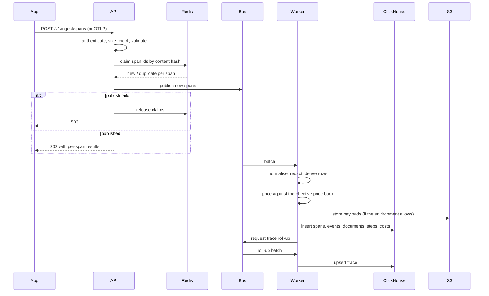

# Ingestion pipeline

## Idempotency, end to end

A span's identity is `(organization, trace_id, span_id)`, and its content hash
decides whether a re-delivery is the same span or an update.

- **At the API**: the content hash is claimed in Redis. A second delivery of the
  same span is reported as a duplicate and not republished.
- **At the store**: `ReplacingMergeTree(ingest_version)` in ClickHouse, and
  `ON CONFLICT DO UPDATE` guarded on `ingest_version` in SQLite. A re-delivered
  span with an equal or newer version replaces the row; it never adds one.

Both layers are needed. Redis makes the common case cheap; the store makes it
_correct_, including when Redis has been flushed or is unavailable.

### The bug this design had

The dedup claim was originally taken before publishing and never released on
failure. A publish error therefore lost the spans permanently: the retry saw its
own claim and reported "duplicate, already ingested". The claims are now
released when publishing fails — visible in `services/ingestion.py` as
`_release_dedup_claims()`.

## Normalisation

The worker turns wire spans into storage rows:

1. Lower-case and validate attribute keys against the registry.
2. **Build derived rows first** — retrieval documents, agent steps — from the
   _raw_ attributes.
3. **Then** redact, and store the redacted attributes.

Step order matters. `aiobs.retrieval.documents` is a sensitive attribute; an
earlier version redacted before deriving, so every retrieval view was empty
while the ingestion tests passed.

4. Promote known attributes into columns.
5. Compute derived fields the SDK cannot know: self time, critical path,
   retry grouping.

## Costing

Every span with a provider, a model and usage is priced, regardless of its
category. Keying off `category == llm_generation` was tried and missed
embeddings, reranks and any application that categorised its own spans
differently.

The price book snapshot is resolved once per batch, not per span.

## Roll-up

Trace roll-ups are computed after the spans are written, not in parallel with
them. Publishing the roll-up request from the API meant the roll-up sometimes
ran before the spans it summarised had landed, producing a trace row with a span
count of zero that only a later re-delivery would correct.

Roll-up is idempotent and monotonic: recomputing from the same spans gives the
same row, and a late-arriving span produces a new roll-up that supersedes the
old one.

## Late and out-of-order data

Spans arrive out of order routinely — a child before its parent, a root minutes
after its children on a long request.

- A span whose parent is unknown is stored and marked. The UI shows it at the
  root of the waterfall with an explanation rather than dropping it.
- A trace roll-up is recomputed on every new span for that trace.
- A span arriving after its trace's retention horizon is rejected, with a reason.
- `late_arrival` marks spans that arrived well after their end time, because a
  systematic pattern of them means an exporter is misconfigured.

## Failure handling

| Failure                 | Handling                                                                    |
| ----------------------- | --------------------------------------------------------------------------- |
| Malformed span          | Rejected individually with a reason; the rest of the batch proceeds         |
| Handler exception       | Batch retried with jittered exponential backoff                             |
| Repeated failure        | Dead-letter queue, with the batch, the error and the attempt count          |
| Poison message          | Bounded attempts, then DLQ. It never blocks the partition.                  |
| Worker killed mid-batch | Lease expires, batch redelivered. Handlers are idempotent, so this is safe. |

DLQ contents are inspectable and replayable — `aiobs-admin` exposes both. A DLQ
you cannot replay is a data-loss log with extra steps.

## Backpressure

The bus is the buffer. Sized for a multi-hour analytics outage, not for
retention. If the worker cannot keep up, lag grows, and lag is the signal the
worker autoscaler is tuned on — CPU is only a proxy for it.

If the _bus_ cannot keep up, ingest returns 503 and the SDKs back off. This is
the one dependency with no graceful degradation, which is why it is replicated.

## See also

- [Storage](storage.md)
- [Operations: runbook](../operations/runbook.md)
- [ADR-0001: separate ingest and query paths](../adr/0001-separate-ingest-and-query.md)
