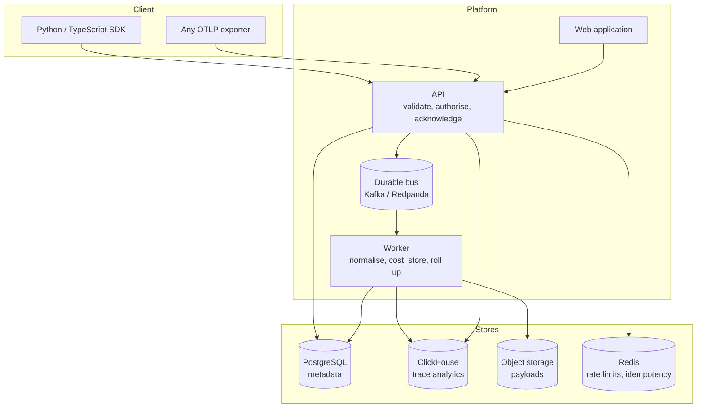

# Architecture overview

## Components

## The one boundary that matters

**The API validates and acknowledges; the worker does the expensive work.**

An ingest request is authorised, size-checked, schema-validated, deduplicated
and written to the bus. That is all. Normalisation, redaction, cost computation,
analytics writes and roll-up happen in the worker, off the request path.

The reason is failure isolation. If ClickHouse is slow, ingest still returns
202 and the bus absorbs the backlog; the applications sending telemetry never
feel it. If the API did the analytics write inline, a storage hiccup would turn
into elevated latency in every instrumented application — the observability
platform degrading the thing it observes.

## Request paths

### Ingest

1. **Authenticate** the API key (keyed hash lookup, cached).
2. **Check the body size** before reading it. A 500 MB body is rejected at the
   first chunk, not after buffering.
3. **Validate** against the wire schema. Malformed spans are rejected
   individually with a reason; one bad span does not fail the batch.
4. **Deduplicate** by content hash, claiming the ids in Redis.
5. **Publish** to the bus. If publishing fails, the dedup claims are released,
   so a retry is not silently swallowed as a duplicate.
6. **202 Accepted**, with per-span results.

### Query

1. **Authenticate** the bearer token, check the epoch (revocation is immediate).
2. **Authorise** against the RBAC matrix.
3. **Parse** filters and sort against a closed grammar. Unknown fields are
   rejected with the list of valid ones.
4. **Build** SQL from a registry of column names, with every value bound.
5. **Execute** against the analytics store, always with a tenancy predicate the
   store adds itself.

## Deployment shape

Two stateless deployments — API and worker — scaled independently. The API
scales with request rate, the worker with bus lag. They share an image base and
configuration, which means one set of settings to reason about and one set of
startup validations.

Everything stateful is a managed service. The chart deploys no databases; see
[deployment.md](../operations/deployment.md).

## Failure behaviour

| If this fails  | Then                                                                                                                    |
| -------------- | ----------------------------------------------------------------------------------------------------------------------- |
| ClickHouse     | Ingest keeps accepting; the bus buffers; dashboards return an error rather than an empty chart                          |
| Redis          | Rate limiting degrades to permissive, idempotency degrades to at-least-once. Both are announced in the health check.    |
| Object storage | Payloads are not stored; spans still are. The span records that its payload is missing.                                 |
| Bus            | Ingest returns 503. This is the one dependency with no graceful degradation, which is why it is durable and replicated. |
| PostgreSQL     | Auth fails, so everything fails. It is the smallest and most replicable of the stores for that reason.                  |

The chaos suite (`tests/chaos/`) asserts these behaviours rather than assuming
them.

## Local development

`make dev-local` swaps every external dependency for an in-process equivalent:
SQLite for both PostgreSQL and ClickHouse, the filesystem for object storage, a
database-backed bus, an in-memory rate limiter. The API starts in about two
seconds and needs no Docker.

This is not a mock. The SQLite analytics driver is a real implementation of the
same interface, held to identical behaviour by the conformance suite that also
runs against ClickHouse. What it is not is a production analytics engine —
which is why `validate_for_runtime()` refuses to start a production process
configured to use it.

## See also

- [Ingestion pipeline](ingestion-pipeline.md)
- [Storage](storage.md)
- [Query model](query-model.md)
- [Multi-tenancy](multi-tenancy.md)
- [ADR-0001: separate ingest and query paths](../adr/0001-separate-ingest-and-query.md)
