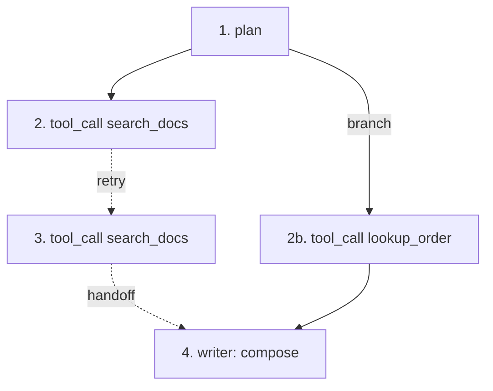

# Agent trajectories

## An agent run is a DAG

Not a list. It branches, retries, loops, and hands off between agents. Rendering
it as a flat sequence of steps hides exactly the structure you need when the
question is "why did this take fourteen steps".



## What a step records

```
step_number        monotonic within the run
step_type          plan | tool_call | observation | reflection | handoff | terminate
agent_id           which agent, when there is more than one
branch_id          which branch of the search
loop_iteration     which pass, when the agent loops
is_retry           whether this replaces a failed attempt
tool_name, tool_status, tool_arguments
decision_summary   short, application-authored rationale
approval_status    not_required | pending | approved | rejected
termination_reason why the run stopped
input_tokens, output_tokens, cost_total
```

## What is deliberately absent

**Raw chain-of-thought.** There is no field for it, no attribute in the
registry, and no UI that would render it.

This is a product decision, not an oversight. Hidden reasoning is the most
sensitive text an agent produces — it contains the model's unfiltered
speculation about the user, the data and the task — and a trace store that
retains it by default creates an obligation nobody asked for. Providers also
increasingly forbid retaining it.

`decision_summary` is what the application chooses to write: one or two
sentences, user-appropriate, deliberate. "Search the knowledge base before
answering" is a decision summary. A 4 KB monologue is not.

## Loops, retries and termination

Three failure modes have first-class support because they are the three that
actually happen:

**Retries.** A retried step is linked to the attempt it replaces, and the
waterfall groups them. Their durations are additive, not overlapping, and a
naive reading of the trace would otherwise suggest the operation took the sum of
its attempts.

**Loops.** `loop_iteration` marks repeated passes, and the graph draws a loop
edge backwards. A detected loop is surfaced prominently, because an agent
revisiting a step it has already performed is almost always a missing
termination condition rather than deliberate iteration.

**Termination.** `termination_reason` and `max_steps` together answer "did it
finish, or did it hit the wall?" A run that terminated at the step limit
produced an answer the same way a timeout produces one.

## Layout is deterministic

The graph is laid out by a deterministic algorithm, not a force simulation: rows
follow step order so time runs downwards, columns are lanes assigned per branch
with the primary branch pinned leftmost. The same trajectory always produces the
same picture.

That matters because trajectories end up in incident reports as screenshots. A
layout that shifts between page loads makes those screenshots impossible to
compare.

## Instrumenting

```python
with trace.agent_span("planner") as agent:
    for step, action in enumerate(plan, start=1):
        with agent.step_span(f"step-{step}") as span:
            span.record_agent_step(
                step_number=step,
                step_type="tool_call",
                agent_id="planner",
                tool_name=action.tool,
                decision_summary=action.why,     # short, deliberate
                is_retry=action.is_retry,
            )
            result = execute(action)
```

## See also

- [Data model](data-model.md)
- [Security: data handling](../security/data-handling.md)
- [Tutorial: instrumenting an agent](../tutorials/instrumenting-agents.md)
