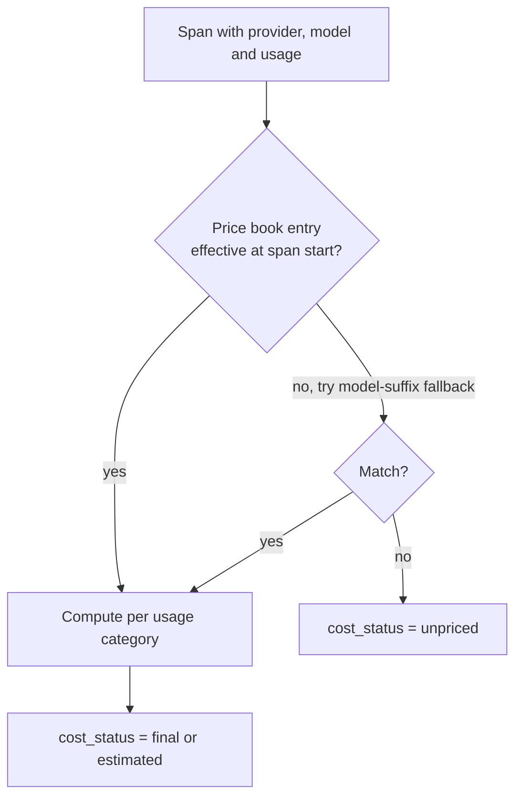

# Cost attribution

## The rule that shapes everything else

**Money is never a binary float.** Not in the database, not in the API, not in
the browser. A per-token price is around `0.0000025`; a float sum of a few
hundred of those produces totals like `2.1456037299999977`, and that number will
eventually appear next to an invoice someone is trying to reconcile.

Concretely:

- Stored as `Decimal(38, 18)` in ClickHouse, as exact text in SQLite.
- Summed by the database's decimal type, or by a user-defined aggregate where
  the engine has none — never by `SUM()` over a text column, which coerces.
- Serialised as **JSON strings**, never JSON numbers, because a JSON number is
  an IEEE-754 double by definition.
- Rendered from the string in the browser. `apps/web/lib/format.ts` takes a
  string and returns a string; it never calls `parseFloat` on money.

The conformance suite asserts this on both storage drivers
(`tests/integration/test_analytics_conformance.py::TestMoneyAggregation`).

## Price books

A price book is a versioned, effective-dated set of entries:

```
provider          openai
model_identifier  gpt-4o
usage_category    input | output | cached_input | cache_write | reasoning | request
unit_price        2.50            (decimal string)
unit_quantity     1000000         (per how many units)
currency          USD
effective_from    2026-01-01T00:00:00Z
effective_to      null            (open-ended = current)
source_url        https://openai.com/api/pricing
```

Effective dating is the whole point. A trace from March is priced with March's
rates even after a provider changes them, so re-pricing a historical trace
reproduces the original number. Hard-coding prices as constants makes that
impossible, which is why
[ADR-0006](../adr/0006-effective-dated-price-books.md) exists.

Books are layered: a built-in default book ships with the platform, and an
organisation may publish its own to override it — negotiated rates, an internal
chargeback multiplier, a provider the defaults do not cover.

## How a span is priced



`estimated` rather than `final` when the token counts themselves were estimated
— see provenance below. The distinction is carried all the way to the UI: a
dashboard showing an estimated total says so.

### The formula is stored

Every priced span gets a `cost_records` row containing each component, the
quantity, the unit price, the unit quantity, and a human-readable formula:

```
(1200 / 1000000) * 2.50 + (340 / 1000000) * 10.00 = 0.0064
```

This is what makes a cost auditable. "The platform says $0.0064" is not a
finding; "the platform says $0.0064 because it used the 2026-01 book's gpt-4o
rates on 1200 input and 340 output tokens" is.

### Cache conventions

Providers disagree about whether "input tokens" includes cached ones. The price
book entry records which convention applies (`cache_inclusive` or
`cache_exclusive`) and the calculator subtracts accordingly. Getting this wrong
double-counts cached input, which on a heavily-cached workload is not a rounding
error.

### Tiered pricing

Both volume tiers (the whole quantity is priced at the tier it lands in) and
graduated tiers (each tier prices its own slice) are supported, because
providers use both and silently assuming one produces a number that is wrong in
exactly the cases where the bill is large.

## Unpriced is not free

If no price book entry covers a model, the span's `cost_status` is `unpriced`
and its cost is **null**, not zero. Every total computed over a window
containing an unpriced span is marked `cost_is_partial`, and the UI says the
total is a lower bound and names the models responsible.

Silently pricing an unknown model at zero is the failure mode this avoids: a new
model rolls out, the dashboard stays flat, and nobody notices until the invoice
arrives.

## Token provenance

Token counts have four possible origins, tracked per span in `usage_source`:

| Source       | Meaning                                                                                         |
| ------------ | ----------------------------------------------------------------------------------------------- |
| `provider`   | Reported by the provider's API response. Authoritative.                                         |
| `estimated`  | Counted locally by a tokeniser. Close, not exact — a different tokeniser version will disagree. |
| `reconciled` | Corrected later against a provider usage report.                                                |
| `missing`    | The call happened, the counts are unknown.                                                      |

A cost computed from `estimated` counts is `estimated`, never `final`. Mixing
the two into one number and calling it "cost" is how a 5% tokeniser discrepancy
becomes an unexplained variance nobody can chase down.

## Currency

Totals are per currency. The platform will not sum across currencies without an
explicit rate, and there is no default rate — an exchange rate is a business
decision with a date attached, not a constant. `MultiCurrencyTotal` returns the
per-currency breakdown and refuses to collapse it.

## What this does not do

- **It does not reconcile your invoice automatically.** It gives you a
  per-span, per-model, formula-level breakdown to reconcile _against_.
- **It does not price your own infrastructure.** GPU time for a self-hosted
  model is a price book entry you write, with `unit_quantity` in whatever unit
  you meter.

## See also

- [ADR-0005: exact decimal money](../adr/0005-decimal-money.md)
- [ADR-0006: effective-dated price books](../adr/0006-effective-dated-price-books.md)
- [Operations: price book management](../operations/configuration.md#price-books)
