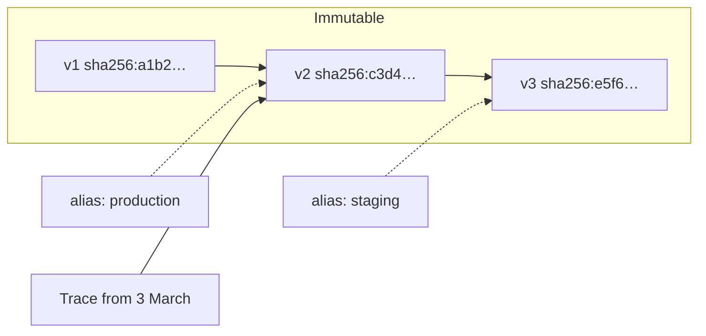

# Versioning and lineage

## The question this answers

"It was fine last week." Without lineage that is unanswerable, because you have
no record of what "last week" was running. With it, comparing two traces tells
you the prompt changed on Tuesday and the temperature changed with it.

## Immutable versions, movable aliases

Two kinds of thing, and conflating them is the mistake this design exists to
prevent:

- A **version** is immutable and content-addressed. Its id is derived from the
  hash of its content. It never changes.
- An **alias** is a movable pointer — `production`, `staging`, `champion`.
  Promoting an alias is the deployment primitive; rolling back is the same
  operation with an older version id.

A trace records the **version id**, never the alias. A trace that said "used the
production prompt" would become meaningless the moment production moved.



## Content addressing

The version id comes from the SHA-256 of the **canonical JSON** of the fields
that define behaviour. For a prompt: the messages, the variable schema, the
default variables, and the template engine. Not the description, not the tags,
not who created it — changing a description does not change what the model sees.

Canonical JSON is [RFC 8785](https://www.rfc-editor.org/rfc/rfc8785) with one
documented departure: keys are NFC-normalised, so two keys that render
identically hash identically. Both SDKs implement it, and a cross-language
fixture (`packages/shared-schemas/json/number-canonicalization.json`, 339 cases)
pins the number formatting so a prompt hashed by the Python SDK and the same
prompt hashed by the TypeScript SDK produce the same digest.

The consequence worth knowing: **registering identical content twice returns the
same version**, it does not create a duplicate. Re-running your deploy script is
therefore free.

## The three registries

### Prompts

A version is a list of role-tagged messages plus a variable schema and a
template engine. The diff is message-level, not character-level, because "the
system message changed" is the useful unit — you want to see which message, and
what the before and after were.

Variable changes are reported separately (`added`, `removed`, `modified`),
because removing a variable breaks every caller still passing it, and that is a
different severity from rewording a sentence.

### Models

A **model** is provider + identifier: `openai` + `gpt-4o`. A **configuration
version** is the hash of the parameters that change behaviour: temperature,
top_p, top_k, max tokens, stop sequences, deployment name, region, API version,
and the provider's `system_fingerprint` when it gives one.

Two runs with the same model name and different temperatures are not the same
thing. Recording only the model name loses the distinction, and then a
regression caused by a temperature change is indistinguishable from one caused
by the provider.

### Datasets

A dataset version is the hash of its **file manifest** — each file's sequence,
checksum, size and row count — not of the bytes. That makes registering a
100 GB evaluation set cheap and means the platform never has to hold the data
to version it.

Datasets carry two fields the others do not: `license` and
`contains_sensitive_data`. The default for the latter is `true`, because
"we did not know that evaluation set had personal data in it" is not a
defensible position and an opt-out is safer than an opt-in.

## Recording lineage from an application

```python
with client.trace("answer") as trace:
    prompt = registry.resolve("support-reply", alias="production")
    with trace.generation_span("generate") as span:
        span.set_lineage(
            prompt_name=prompt.name,
            prompt_version_id=prompt.version_id,   # the resolved id, not the alias
            model_config_id=config.version_id,
        )
```

Missing lineage is not an error. It means the application did not record it, and
the UI says exactly that rather than showing a blank field. What it costs you is
the ability to attribute a regression, which is why the trace detail page states
it explicitly.

## See also

- [Cost attribution](cost-attribution.md) — prices are effective-dated for the same reason versions are immutable
- [ADR-0003: content-addressed versions with movable aliases](../adr/0003-content-addressed-versions.md)
- [ADR-0004: canonical JSON and cross-language hashing](../adr/0004-canonical-json.md)
