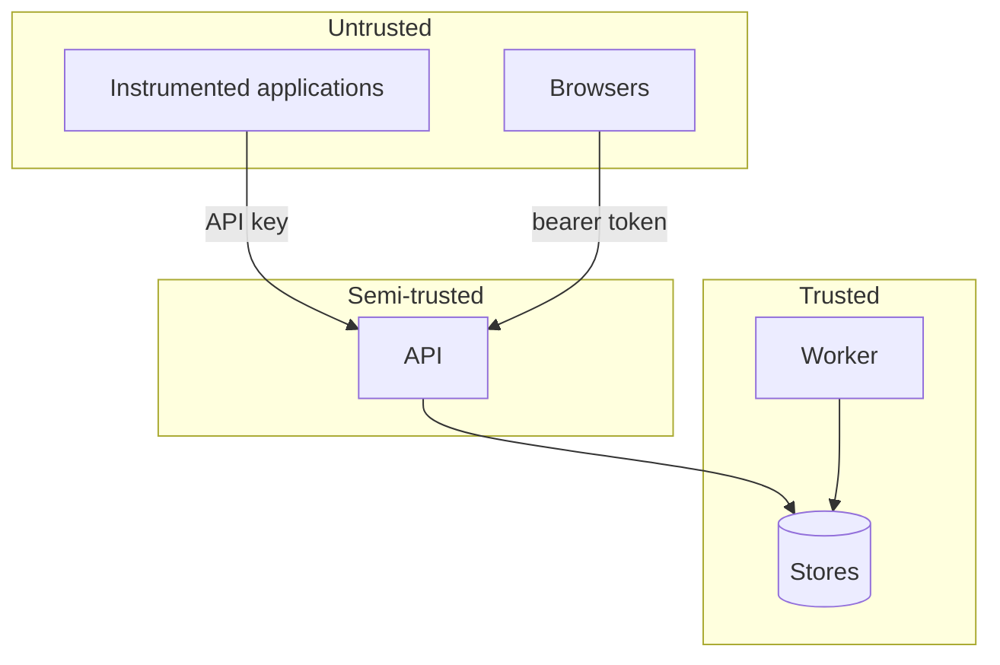

# Threat model

## What this system is worth stealing for

A trace store looks like infrastructure and holds like a database. Its contents:

- **Prompts and completions** — personal data, credentials users pasted,
  proprietary business logic, and whatever your users typed at 2am.
- **Retrieved documents** — the contents of your knowledge base, chunk by chunk.
- **Cost data** — usage volumes, model choices, and enough to infer your
  architecture and your scale.
- **API keys** — as hashes, and hashes for a system that ingests everything.

The realistic attacker is not sophisticated. It is a leaked API key in a public
repository, an over-permissioned analyst account, or a filter parameter that
turned out to be interpolated into SQL.

## Boundaries

Applications are untrusted: they send whatever they send, and the platform
validates every field. Browsers are untrusted: everything they display is
escaped. The API is semi-trusted: it authenticates and authorises, but the
stores still add their own tenancy predicates.

## Threats and mitigations

### Cross-tenant read

_An authenticated user reads another organisation's traces._

Every analytics query carries a tenancy predicate the store adds itself; there
is no code path that constructs one without it. Resource lookups verify
ownership and return **404, not 403** — a 403 confirms the resource exists.
`tests/security/test_authorization.py` attacks this from the other tenant's
side, parameterised over the endpoints.

### SQL injection through a filter

_A filter value becomes SQL text._

The filter grammar is closed. Field names come from a registry, operators from
an enum, and values are always bound parameters. No user string reaches a query
builder as an identifier. The property tests throw generated hostile strings at
the parser.

### Cursor tampering

_A crafted cursor reads rows outside the caller's scope._

Cursors are HMAC-signed and verified before use. The tenancy predicate is
applied independently of the cursor, so even a forged one cannot escape the
organisation.

### Stored XSS through a prompt

_A prompt containing markup executes in another user's browser._

React escapes by default; `dangerouslySetInnerHTML` appears nowhere. `SafeText`
exists so that rendering untrusted content is a reviewable decision rather than
an accident. A strict CSP is served. `tests` assert the escaping.

### Session theft

_An attacker steals a token._

Tokens are short-lived and carry a user epoch, so revocation is immediate.
They are held in `sessionStorage`, not a cookie — unavailable to CSRF, at the
cost of being reachable by XSS, which the CSP and escaping rules address. That
trade is documented in `apps/web/lib/api.ts` where it is made.

### API key leakage

_A key ends up in a public repository._

Keys are scoped to one project and environment, and to `ingest` and/or `read` —
never to administration. `last_used_at` makes unused keys findable. Revocation
is immediate. The secret scanner runs on every push and on the full history.

### Denial of service through expensive queries

_One tenant asks a question that starves the cluster._

Time ranges are capped at 400 days, page sizes at 500, group cardinality at the
top N. Query timeouts are configured. Rate limits are per key and per
organisation.

### Ingest flood

_A misconfigured application sends 100× its normal volume._

Per-key rate limiting, body size limits checked before reading, batch size
limits advertised at `/v1/ingest/limits`. Over the limit is a `429` with
`Retry-After`, which the SDKs honour with jittered backoff.

### Privilege escalation

_A developer grants themselves administrator._

The role matrix blocks granting a role above your own, and the last owner cannot
be removed or demoted. `ensure_owner`, the one function that assigns ownership
without a permission check, is reachable only from the CLI by someone who
already has database access — and it adds a missing membership rather than
promoting an existing one, so re-running bootstrap cannot silently escalate a
viewer.

### Data exfiltration through exports

_An analyst exports everything._

Exports are audited with the requester, the resource and the row count. Export
files expire. Redacted exports are the default, and an unredacted export is
labelled as such in the UI and the audit log.

### Compromise of the platform itself

_An attacker gets code execution in a pod._

Containers run as a non-root user with a read-only root filesystem, all
capabilities dropped, and no service account token mounted. The IAM role is
scoped to two object-storage prefixes. Optional network policy denies egress
except to an explicit allowlist — because a system holding prompts should not
have general internet access.

## Accepted risks

**A platform administrator can read stored payloads.** That is what
administration means. The mitigations are SDK-side redaction (so they never see
what you removed), payload storage being off by default in production, and the
audit log.

**SDK-side redaction is best-effort.** It catches the shapes that actually leak
— provider keys, private keys, bearer tokens, JWTs — and lets applications add
detectors. It is not a PII classifier and does not claim to be.

**Near-duplicate detection compares truncated previews.** It catches copied
chunks, not paraphrase.

## See also

- [Data handling](data-handling.md)
- [Authentication and authorization](authentication.md)
- [SECURITY.md](../../SECURITY.md)
